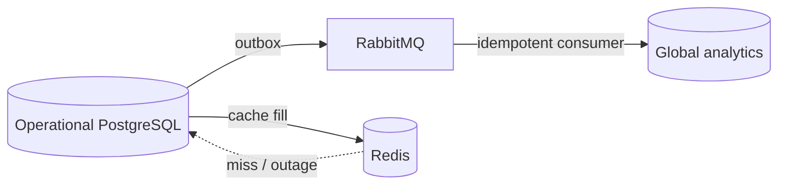

# Потоки данных

## Завершение рейда

```mermaid
sequenceDiagram
  participant W as Mini App
  participant A as API
  participant D as PostgreSQL
  participant O as Outbox publisher
  participant Q as RabbitMQ
  W->>A: POST /raids/{id}/answer + Idempotency-Key
  A->>D: BEGIN; lock raid + wallet
  A->>A: validate tenant/state; score answer
  A->>D: attempt + raid + XP + ledger + outbox
  A->>D: COMMIT
  A-->>W: result + reward
  O->>D: claim unpublished (planned)
  O->>Q: raid.completed / reward.granted (planned)
```

Клиент хранит ключ незавершённой операции в `sessionStorage`. Сервер хеширует его вместе с tenant, actor, operation и raid, поэтому одинаковые клиентские UUID разных пользователей не пересекаются. Повтор с тем же ключом возвращает сохранённый эффект без второго ledger entry; повтор с другим ключом встречает терминальное состояние рейда. Частичный уникальный индекс не допускает двух активных рейдов одного персонажа.

## Аналитика


