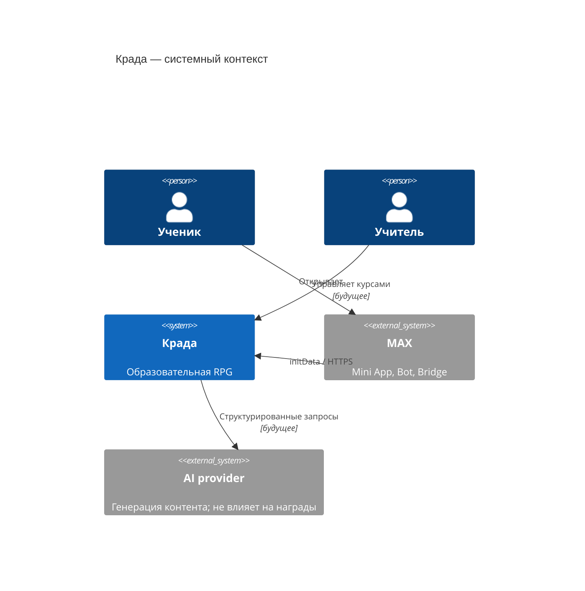
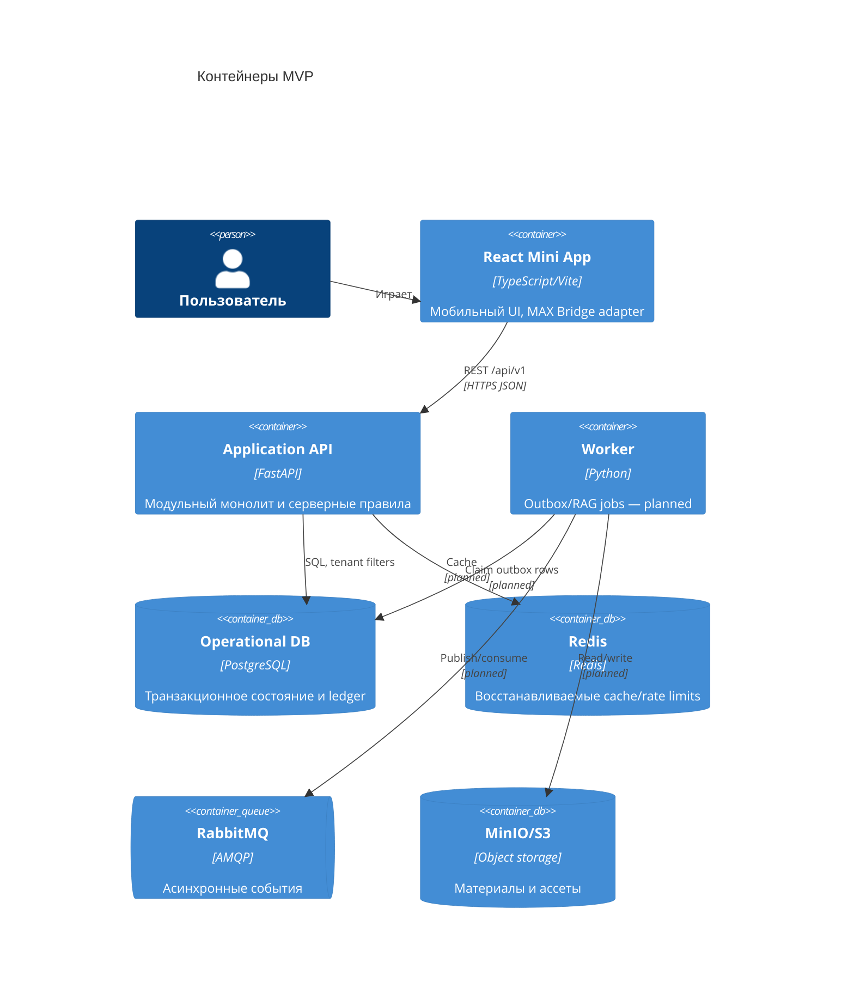

# Архитектура Крады

Статус: реализован фундамент и один вертикальный MVP-сценарий. Архитектурный стиль — модульный монолит с портами к MAX, PostgreSQL, Redis и брокеру. Это сохраняет дешёвое локальное развёртывание и даёт явные границы для будущего выделения горячих модулей.

## Границы модулей

`identity` подтверждает платформенную личность и выпускает сессию; `organizations` владеет школами, классами и членствами; `game` — чистыми детерминированными правилами и реестрами; `raids` — state machine и попытками; `economy` — кошельками, ledger и наградами; `content` — версионным учебным содержимым; `analytics` потребляет события и не участвует в игровой транзакции. Сейчас физически реализованы минимальные части первых пяти модулей. Не реализованные части не выданы за готовые сервисы.

## Инварианты

- `school_id` берётся из подписанной сессии, не из тела запроса; любой доступ к игровому объекту фильтруется им.
- Правильный ответ отсутствует в публичном DTO.
- Переходы рейда задаёт state machine; клиент не присылает состояние, очки или награду.
- Попытка, прогресс, ledger и outbox фиксируются в одной транзакции.
- Redis, брокер и аналитика не являются источниками истины.
- Событие содержит UUID, тип, schema version, producer, subject, tenant, correlation и payload.

## Масштабирование

MVP использует одну PostgreSQL. `school_id` и глобальные UUID позволяют позднее добавить `TenantRouter` (`school_id → shard_id`) без изменения публичных контрактов. Переход оправдан при устойчивом превышении ёмкости вертикального кластера, шумных tenant или требованиях изоляции. Перенос: заморозить записи школы, дождаться outbox watermark, скопировать и сверить данные, переключить registry, прогреть кэш, разморозить. Межшардовые транзакции запрещены; глобальные рейтинги eventual-consistent. Резервные копии и restore проверяются на каждом шарде отдельно.

## Отказы

Redis недоступен — чтение идёт в PostgreSQL; брокер недоступен — события остаются в outbox; analytics недоступна — рейды продолжаются; AI недоступен — статический банк вопросов; переподключение — `GET /raids/{id}` возвращает серверное состояние. Публикация outbox и эти деградационные тесты ещё не реализованы, поэтому отказоустойчивость пока не заявляется.
