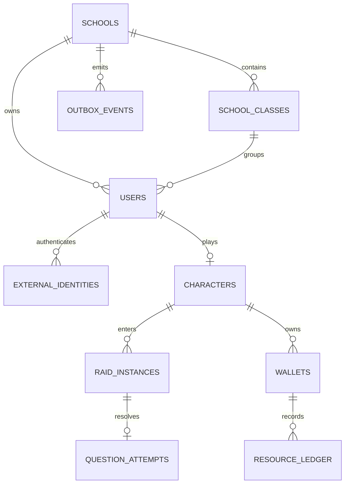

# ERD вертикального MVP

Определения контента (`character_classes`, `questions`, `raid_definitions`) в MVP представлены версионируемой серверной конфигурацией, а не пустыми таблицами. Перенос в таблицы нужен вместе с редактором контента. Следующая миграция добавит versioned `courses → modules → topics → materials → questions`, inventory definitions/instances и RBAC.

Tenant-owned таблицы имеют `school_id` и индекс. Application-level фильтры обязательны. RLS запланирован как defence-in-depth: транзакция должна выполнять `SET LOCAL app.school_id`, политика сравнивает его с `school_id`; `SET LOCAL` критичен при pooling, чтобы tenant не протёк в следующую сессию.
